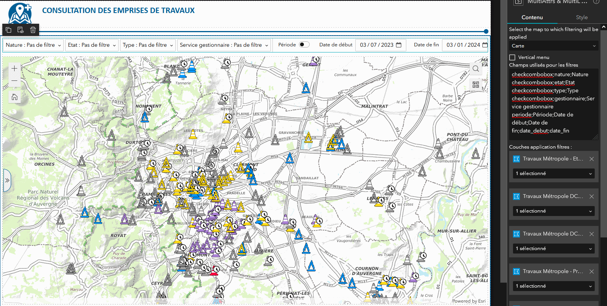

# A Widget for ExperienceBuilder for ArcGis
This widget add buttons for filtering data on several layers and/or fields at once.
Attribute filters are cumulative and will be applied to the layer list.
The widget currently manages filters by attribute values ​​(multiple choice combobox) and time periods (requires a start attribute and an end attribute in date format)

## Installation
Copy this directory in the widget folder of your Experience Builder client.
See : https://doc.arcgis.com/en/experience-builder/11.0/configure-widgets/add-custom-widgets.htm

## Configuration
The settings of the widget :
- Select a map to link to the widget
- Choose horizontal or vertical disposition for the buttons
- Filters settings : two text lines per button, one for the displayed text of the button, and another for the sql filter that will be applied when you click on the button.

    Syntax : 
    
        checkcombobox;attribute_name;attribute_alias
        or
        periode;label;label_start;label_end;attribute_start;attribute_end

- Select one or more datasource layers that you want to be filtered

## Example
